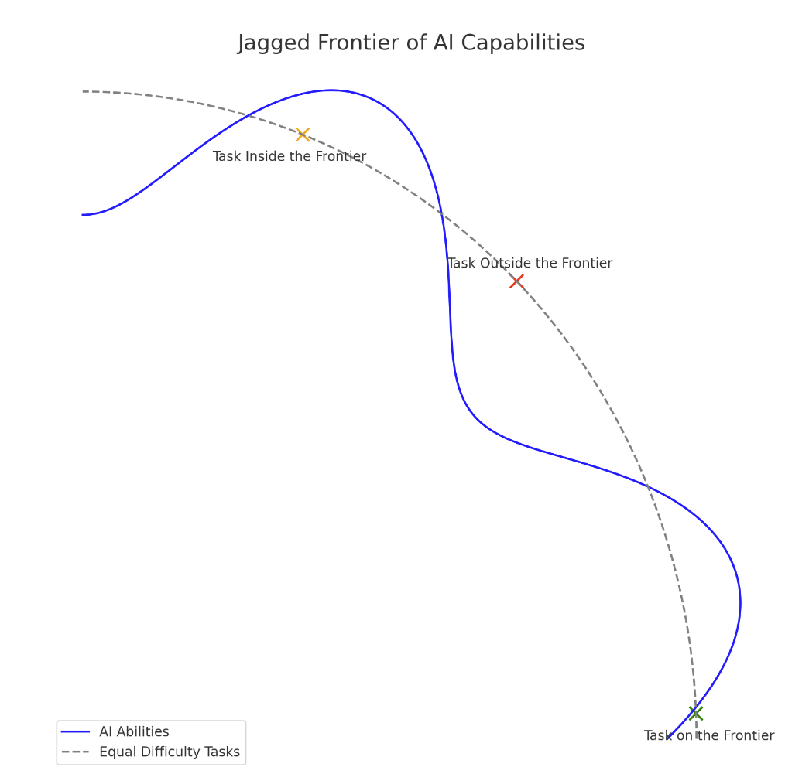
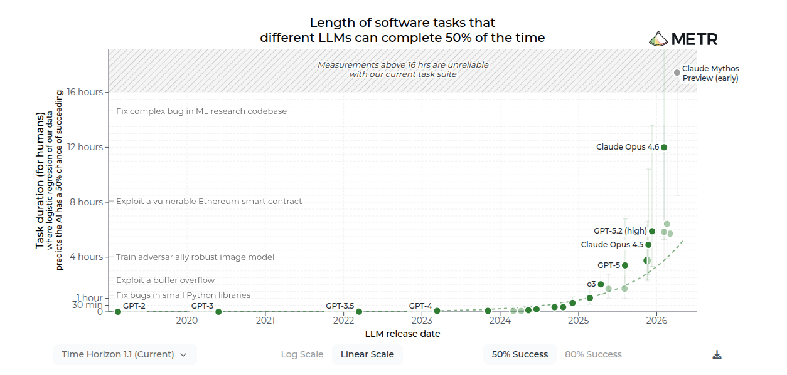

> 在2026年，AI的能力边界在哪里？

## 能力边界定义

最初人们认为AI的能力是实验室中的试验品，是特定任务领域的解决方案（图像/语音识别）。但在2022年ChatGPT的发布，使得AI能力第一次真正走入大众视野被大家广泛使用。23年GPT-4现象级的推出，彻底开始了此次AI大基建和大革命。23年GPT-4只能生成高质量文字，24年2月Sora便能够生成高质量视频，5月OPENAI发布GPT-4o，将推理过程中的思考过程可视化，真正看到了推理过程的思维链。24年春节Deepseek发布的V3/R1，在成本大幅降低的情况下，实现较高的模型性能，引起行业地震。25年至26年，Anthropic、OPENAI、Google又在模型性能上疯狂军备竞赛，国内Kimi、智谱、千问的模型性能也在大幅提升。各种类型的任务，都被AI逐步掌握。

AI能力迅猛发展的今天，其能力边界正被不断扩张，其实很难给出一个确切的定义。但有一些概念和思想，是通用的，可以用来指导我们理解。

### 锯齿状的能力边界
在[Navigating the Jagged Technological Frontier](https://mitsloan.mit.edu/sites/default/files/2023-10/SSRN-id4573321.pdf)一文中，提到了Jagged Technological Frontier的概念，即技术能够影响的边界是锯齿状的，而非平滑的。这篇2023年的论文，在chatgpt4发布的基础上进行实验和讨论，虽然实验具体的任务对于2026年的模型已经基本被更好解决，但是作者也同时预测到“模型的能力还在迅速增强，但是其在处理不同类型任务的能力上，还是存在不平衡的情况”。

*图片来源：[Navigating the Jagged Technological Frontier](https://mitsloan.mit.edu/sites/default/files/2023-10/SSRN-id4573321.pdf)*
对于人类来说相同难度的任务，可能对于AI来说难度是各不相同的，这造成了AI能力的锯齿状边界。

### 边界的维度
对模型能力的评测是一件必要且复杂的事情，在[HELM](https://arxiv.org/abs/2211.09110)之前，对于模型的评价都是碎片化非体系的。其主导使用透明、全面且标准化的模型基准测试与评估体系。核心思想评估理念是将评估拆解为多个维度。核心能力包括：准确性（Accuracy）、鲁棒性（Robustness）、安全性（Safety）、校准度（Calibration），社会影响方面：偏见（bias）、毒性（toxicity）以及版权和隐私风险。效率和成本上考虑：推理延迟（Latency）、Token消耗和计算成本。以上维度对后来的大模型评估产生了结构性的影响。目前常见的顶级评测项目有[LMArena](https://arena.ai/)、[Artificial Analysis](https://artificialanalysis.ai/)。

### 与人类工时对比
能力边界在不断拓宽，各个维度边界在生长，但是这个过程中，模型能力随时间如何增长，相对于人类能力，如何界定才算“能做”？

[METR](https://metr.org/time-horizons/)则提供了评测模型这一能力的框架，其核心思想是：人类专家在某段时间内能完成任务的基准上，AI模型能够在50%和80%的成功率下完成任务的最长时间。以人能够直觉理解的工时作为基准，可以看到模型能力的50%成功率最长工时时间，随着时间的推移其翻倍时间在不断缩短。

*图片来源：[METR](https://metr.org/time-horizons/)*

## 目前已经能做什么

## 边界主要在哪里

## 相关证据